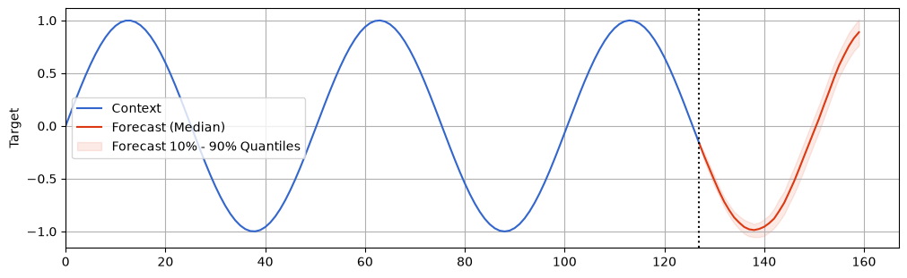
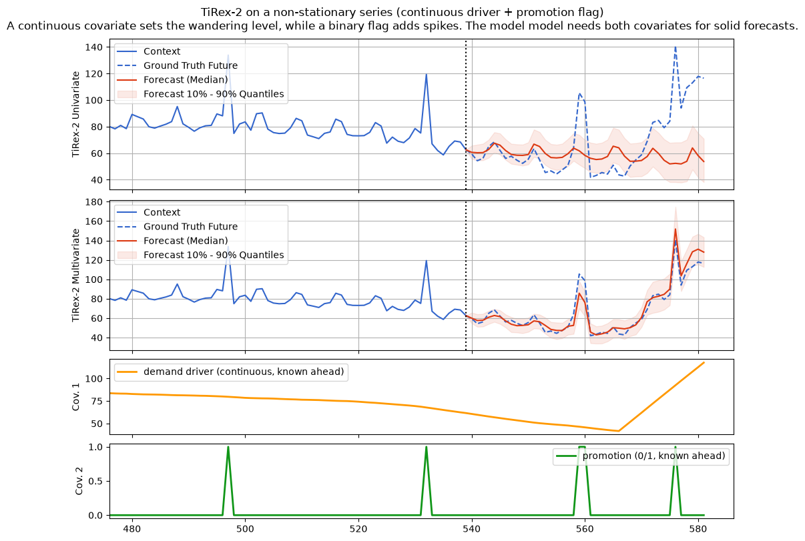

# Quickstart

The easiest way to get started is the
["Getting Started" notebook](https://github.com/NX-AI/tirex-2/blob/main/examples/getting_started.ipynb),
which you can also run directly in Google Colab:

[](https://colab.research.google.com/github/NX-AI/tirex-2/blob/main/examples/getting_started.ipynb)

If you have cloned the repository, start it locally via Pixi:

```bash
pixi run notebook
```

The `notebook` task uses the `examples` environment. Select a different named platform when
needed, such as `--platform linux-64-cpu` for CPU-only Linux or
`--platform linux-64-cuda-126` for CUDA 12.6. Platforms and environments are defined in
[`pyproject.toml`](https://github.com/NX-AI/tirex-2/blob/main/pyproject.toml).

## Minimal usage: predicting a simple sine wave

```python
import torch
from tirex2 import TimeseriesType, load_model
from tirex2.plotting import plot_multivariate  # requires matplotlib to be installed

# load model
model = load_model("NX-AI/TiRex-2", device="cpu")  # use `device="cuda"` if cuda is available

# generate data - target expects time series of shape (n_targets, context_length)
context = torch.sin(torch.arange(128).float() / 8)
ts = TimeseriesType(target=context.unsqueeze(0), past_covariates=None, future_covariates=None)

# perform forecast - each forecast is of shape (n_targets, 9 quantiles, prediction_length)
forecast = model.forecast([ts], prediction_length=32, output_type="numpy")[0]

# visualize result
fig = plot_multivariate(ts, forecast, engine="matplotlib")
fig.show()
```



## Covariate example

This example originates from the "Getting Started" notebook, showing the value of additional
covariates.

```python
from tirex2 import load_model
from tirex2.demo import Demo, plot_demo_forecast

# load model
model = load_model("NX-AI/TiRex-2", device="cpu")  # use `device="cuda"` if cuda is available

# load data
demo = Demo.create_nonstationary_demo()
ts_univariate = demo.to_timeseries_type(include_covariates=False)
ts_multivariate = demo.to_timeseries_type(include_covariates=True)

# perform forecast - each forecast is of shape (n_targets, 9 quantiles, prediction_length)
forecasts = model.forecast(
    timeseries=[ts_univariate, ts_multivariate],
    prediction_length=demo.horizon,
    output_type="numpy",
)

# visualize result
fig = plot_demo_forecast(demo, *forecasts, engine="matplotlib")
fig.show()
```



## Next steps

- [Forecasting](../how-to/forecasting.md) — univariate and multivariate forecasting in depth.
- [Covariates](../how-to/covariates.md) — past and future-known covariates.
- [Streaming](../how-to/streaming.md) — what's open-source and what's Pro-only.
- [API reference](../api/index.md) — full signatures and parameters.
